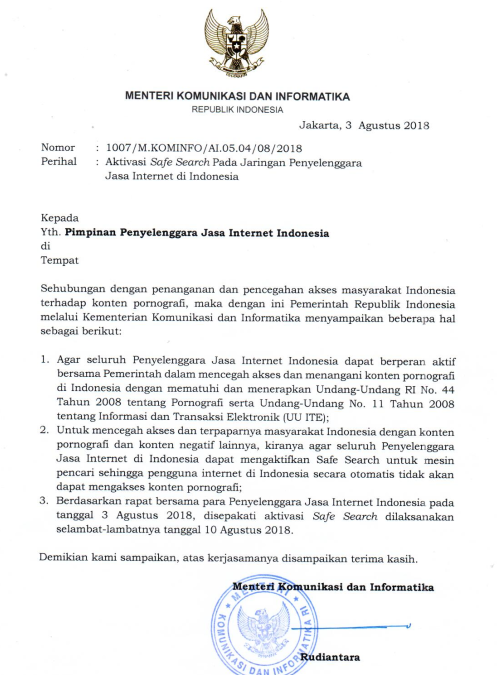
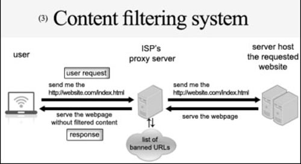
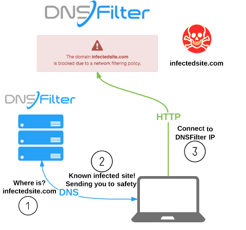
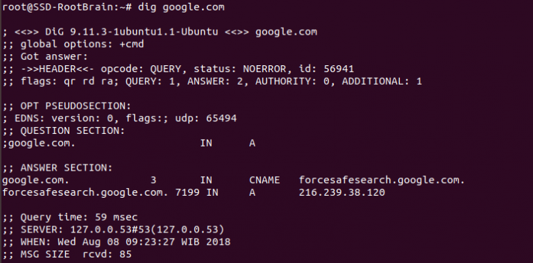

# DNS filtering and Indonesia's censorship
I recently came across an interesting [article](https://infosec.id/2018/08/mengulas-pemblokiran-internet-di-indonesia-mengapa-pemblokiran-dengan-dns-filtering-dns-tampering-tidak-akan-berfungsi-dalam-waktu-dekat/) that analyze the impact of DNS filtering towards Indonesian website filtering system. Below is the translated transcript of the said article.

## Analyzing internet blockade in Indonesia and why blocking via DNS filtering will not work in the near future
_by [Josua Sinambela](http://josh.rootbrain.com/blog/)_

A few days ago - on the 3rd of August 2018 - Indonesia's minister of communication (Kominfo) released an official statement telling all ISPs in Indonesia to activate safesearch/restricted mode/safe mode to every known search engine by August 10th 2018. Here is the transcript of such statement.

### Introduction and an overview of Indonesia's internet blockade
A few years ago, Kominfo, through their TrustPositif program, instructed all ISP and NAP to restrict access to sites that exhibits pornographic, violence, and discriminatory (towards race, religion, etc). The government - through Kominfo - routinely inspects ISPs/NAPs compliance to TrustPositif program. Noncompliance from ISP/NAP will result in an official government warning. However there was a news in the year 2000s that the blocking technique that was recommended by Kominfo was to utilize proxy cache server (mode transparent proxy). Kominfo also gave the tutorial on their website - trustpositif.

With this filtering technique that functions as a proxy server, the blocking can be done until the application layer, such as URL Regex or any specific domain, by comparing each URL that was accessed by each users with a domain/URL database that was setup by Kominfo's TrustPositif team, but as suspected [here](https://josh.rootbrain.com/blog/2014/05/15/keputusan-kemkominfo-yang-pilih-kasih-belajar-dari-pemblokiran-situs-situs-top-dunia/) and [here](https://josh.rootbrain.com/blog/2008/04/05/kebijakan-pemerintah-menkominfo-yang-sangat-tidak-bijak/), there were a lot of problems such as a drop in internet speed, or the inability of the NAP/ISP's proxy machine to handle a floodloads of request with high density traffic. Moreover, SSL technology has been growing rapidly on many sites such that such technique starts to become ineffective and later abandoned.
To replace the outdated system, providers agreed to utilize DNS filtering/tampering such as the ones used by OpenDNS or NAWALA activists with the difference being every provider would have to automatically redirect every DNS queries from their customers/users to a DNS that was provided by every operator/ISP using the [RPZ Response Policy Zone](https://dnsrpz.info/) that was developed by the [ISC](https://en.wikipedia.org/wiki/Internet_Systems_Consortium) or with a similar service such as PowerDNS.
With this technique, every DNS queries from any provider's users would be redirected to a DNS provider server automatically, thus every provider has to prepare a specially tough DNS server to serve every user queries. Every DNS server will use a given [domain database of banned sites](https://trustpositif.kominfo.go.id/) that was distributed by the Kominfo. If at any given time a user queries a domain/subdomain that is listed on the database of banned sites, then the user will be mapped to a server IP that was prepared beforehand to inform him/her that the site has been blocked. Some ISP/provider even utilizes such page to show advertisements in order to reap profits to the said provider.
This makes the role of such DNS server very critical because it can become a boomerang to the provider if their DNS is not responsive or is not capable of properly serving each user's requests. This is one of the reason why there has been complaints from the users to the provider if they are experiencing an interrupted connection or even disconnection (because of problems with resolving DNS), even though the same website would be accessible with no problem given that it is being accessed from a different region (country). Because of the DNS factor that was not maintained or serviced well enough, customers become the victim of a half-hearted service of a DNS provider. [APJII](https://www.apjii.or.id/) once gave a suggestion to distribute blacklisted domain using database (mySQL) that is acccessible or replicate-able for every NAP/ISP [such as the one explained here](https://www.kominfo.go.id/content/detail/4971/ini-usulan-apjii-untuk-filter-internet-indonesia/0/sorotan_media).

In actuality, this internet-filtering technique via DNS tampering also possesses a lot of problems and ways to bypass them, but the author did not discuss those points in the given article. The author only gave a glimpse of the risks in redirecting/forwarding all DNS requests from the customer to a DNS machine would automatically present the possibility of _single point of failure_ and also if the said DNS is not maintained or provided with a good security measure, it might exude a fatal consequences in the expense of the provider's customer (i.e. DNS corruption/collision/poisoning attack towards the provider's DNS server).

### What is safe search?
Safe search/safe mode/restricted mode is a service/feature of a search engine, such as Google/YouTube/Bing, that functions in performing an automatic filtration system towards negative content such as pornography or violence.
Safesearch can be activated on any application level or any session of each application. The activation of SafeSearch feature had always been optional, but urgencies to remove pornographic content forces OTT provider such as Google/Microsoft/Twitter/etc to automatically activate SafeSearch from the get go based on queries towards their domain service. For example [www.google.com](https://www.google.com/) will be mapped to an alias domain (CNAME) **forcesafesearch.google.com** (216.239.38.120), bing.com (Microsoft) will be mapped to **strict.bing.com** (204.79.197.220), youtube.com will be mapped to **restrict.youtube.com** (216.239.38.120) etc.
By remapping user's query results, SafeSearch feature will be activated automatically on the given search engine that was accessed by the user. As long as such mapping scheme exists, every request for a search page will be filtered in SafeSearch/Safe Mode.
This method is the agreed-upon method between the Kominfo party and Indonesian's ISP party to be implemented at this moment as per the official statement that was issued by Kominfo earlier at the top of the article.
_Now comes the problem, is the method effective enough in reducing access to pornographic content? Will it be up to Kominfo's expectation like the one that they presented in the frontpage of a news outlet saying [Next week, all porn contents in the internet will vanish](https://www.liputan6.com/tekno/read/3609142/minggu-depan-seluruh-konten-pornografi-di-internet-bakal-lenyap)? Will the method last for a long time?_
If such questions were to be thrown towards the author of this article, then the answer will definitely be **NO**. Like the autor had posted on his [Facebook status](https://www.facebook.com/jsinambela), this filtering method will utilize safesearch similar to how a magic show is in actuality an illusion, that may exudes positive impact to young people - students. If the targets of such filtration system are schoolkids, then there may be positive impacts that can be reaped from such filtration system.
In principle, it is true that SafeSearch is provided by OTT service, such as Google/Microsoft, to protect kids from the negative effects of the interet such as violence and pornography which is why since the feature was introduced in 2014, a lot of schools and families had already used the SafeSeach feature manually through their own accounts as a parental control service.
Even though there are a lot of flaws in this filtering via DNS tampering technique and especially on the forced-activation of SafeSearch/Restricted Mode, the author will not be discussing how to bypass such measures, but it is important to keep in mind that the number of search engine that provides SafeSeach/Safe Mode through DNS tampering is very limited. Has there been any studies on how the user would be irritated by the measure and migrates him/herself to another search engine, such as [DuckDuckGo](https://duckduckgo.com/) which heavily protects the privacy of its users? Or perhaps users may manually input the IP address of a non-SafeSeach-enabled seach engine? Or perhaps users may create a mapping/local DNS to access the sites?
Another way to bypass the filter that is quite simple in terms of execution is by using VPN or a Proxy; the more elegant way is to use DNS over HTTPS and/or DNS over TLS which as of this moment has [its own Standard RFC](https://tools.ietf.org/html/rfc7858). Of course these would drive government, who acts as regulators, a bit overwhelmed. How could it not? Over the last years, the government and provider has been relying on DNS filtering/tampering in applying internet filters because as of right now Indonesia's internet users generally still use an archaic DNS protocol that is plain text in nature (UDP/53), such that providers are able perform filtering/tampering towards the said DNS query. For your information, network forensic has enabled DNS queries from each userto be read in the DNS server which enables them to study the user's behavior, access their internet chronology/history, or even to conduct a profiling of a customer.
Standards over Specification for DNS over TLS has been set in [RFC7858](https://tools.ietf.org/html/rfc7858) from May of 2016. The document manages on how DNS works using the TLS protocol to ensure confidentiality, and to avoid eavesdropping, and ensuring the privacy of its user. In other words, the communication between user and DNS server using DNS over TLS protocol will not be easily eavesdropped or fall into the filtering/tampering system that has been set in place by Kominfo. Right now there has been many servers that provide DNS over TLS service, for example the one that is most popular as of recently is the public DNS Cloudflare (1.1.1.1 and 1.0.0.1) who has been providing the service to all internet users. Aside from supporting DNS over TLS, Cloudflare also supports DNS over HTTPS and DNS over FUN, the rest can be read [here](https://developers.cloudflare.com/1.1.1.1/dns-over-tls/), [here](https://developers.cloudflare.com/1.1.1.1/dns-over-https/), and [here](https://developers.cloudflare.com/1.1.1.1/fun-stuff/).
In the future, there will be a lot of Operating System such as Android P (Pie) AKA 9 which by default would support DNS over TLS protocol (read: [here](https://android-developers.googleblog.com/2018/04/dns-over-tls-support-in-android-p.html)). Author's Linux OS Ubuntu has been able to use the protocol by default simply by installing an application package and it can roundrobin the query to various DNS servers that support DNS over TLS all over the world. The default is to use TCP port/853, but generally there has been a lot of DNS server that listens to TCP port/443 which is the port that is usually being used for SSL/HTTPS.

DNS filtering/tampering from ISP

Using DNS over TLS

### What will happen if every OS or gadgets have applied DNS over TLS or DNS over HTTPS?
This means that there is a huge possibility that DNS tampering that is done by the provider like the one that is in place right now will become obsolete and will not function well. Thus as the regulator, the government will be hoping to find a technique or another method to implement the law to filter internet content that works and hopefully that won't mean that they will buy another expensive "crawling machine."

Hopefully the government - through Kominfo - will have a lot of ammunition, starting from crawling machine that is valued at 200 billion Rupiah (around $13.5 million) called AIS and skilled operators for such machine that are just recruited recently with fresh takes and ideas - not simply copying China's or Iran's method of censorship.

Hope this helps!

# Site is out on minimum functionality!
After constant procrastination, I finally managed to complete the barebone of my github page! Here, I will post gists of my projects and perhaps share my thoughts on anything. For now however...
